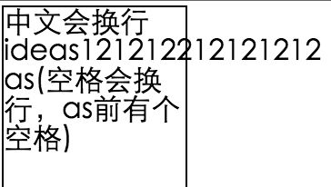
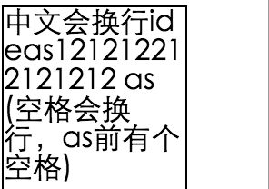

#word-break  word-wrap  white-space的用途与区别

最近经常遇到有关换行的需求，然而每次都需要查下api，这必然会让自己觉得低效又懊恼，所以干脆集中花点时间，探索下换行相关css属性－－word-break、word-wrap和white-space。

先说说在不设置任何属性的情况下，浏览器对换行的默认处理。  
概括起来主要有以下三点：   
1. 浏览器会把空格、连字符、CJK(Chinese, Japanese, Korean)字符当作断点   
2. 尽量让内容不溢出容器  
3. 没有断点的地方不换行，即使会溢出容器   
来看张图：  
  (图1)

现在来看看word-break,word-wrap,white-space三个属性对换行的影响  

一. word-break:  
可取的值（这里讨论对换行有影响的关键词属性值）：break-all,keep-all

break-all:在除了CJK的单词内部也可以进行换行。一刀切，只要碰到容器边界，就换行，不管是不是断点处。如下图：  
  （图2:图1基础上加上break-all属性）

keep-all:w3c的解释是“只能在半角换行符和连字符处换行”。在默认处理换行的基础上，修改换行点成半角换行符和连字符。CJK字符不再做为断点。其他跟默认情况保持一致。但是这个属性值在不同浏览器下表现有所不同。

<table>
    <tr>
        <td>chrome、opera</td>
        <td>firefox、safari</td>
    </tr>
    <tr>
        <td>全角、半角空格，连字符换行</td>
        <td>只有半角空格时换行</td>
    </tr>
</table>

二.word-wrap:break-word   
可以在非CJK单词（如英文单词）中间换行，但是和break-all的区别是，break-all会尽量不在非CJK单词（如英文单词）中间换行，没地方换行了才会选择在非CJK单词（如英文单词）中间换行。

三.white-space

<table>
    <tr>
        <td>值</td>
        <td>描述</td>
    </tr>
    <tr>
        <td>normal</td>
        <td>默认值。会忽略换行符，并合并多余的空格成一个。</td>
    </tr>
    <tr>
        <td>nowrap</td>
        <td>忽略换行符，合并不是换行符的空格为1个</td>
    </tr>
    <tr>
        <td>pre</td>
        <td>保留所有空格的原有意义。当设置此值时，word-break,word-wrap将不起作用</td>
    </tr>
    <tr>
        <td>pre-wrap</td>
        <td>保留所有空格的所有意义，跟pre的区别是，当单词触碰到边界时会进行换行，而pre不会。当设置此值时，word-break,word-wrap将不起作用</td>
    </tr>
    <tr>
        <td>pre-line</td>
        <td>保留换行符，合并不是换行符的空格为1个。</td>
    </tr>
</table>

  

