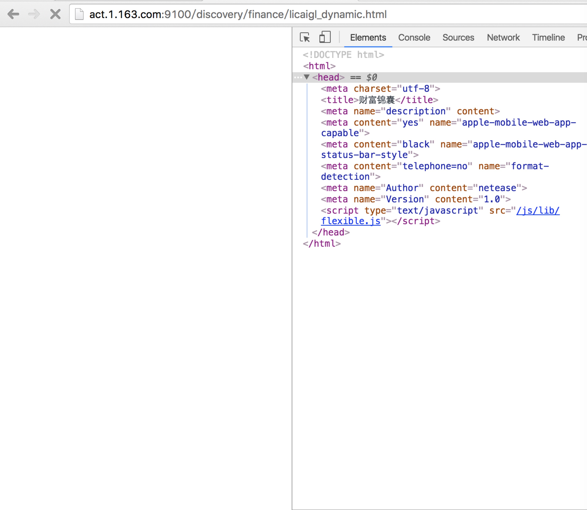
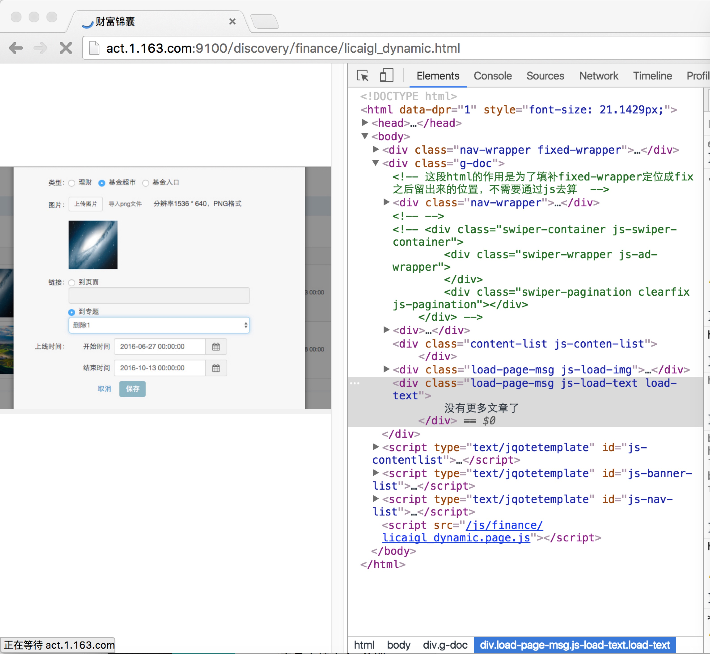
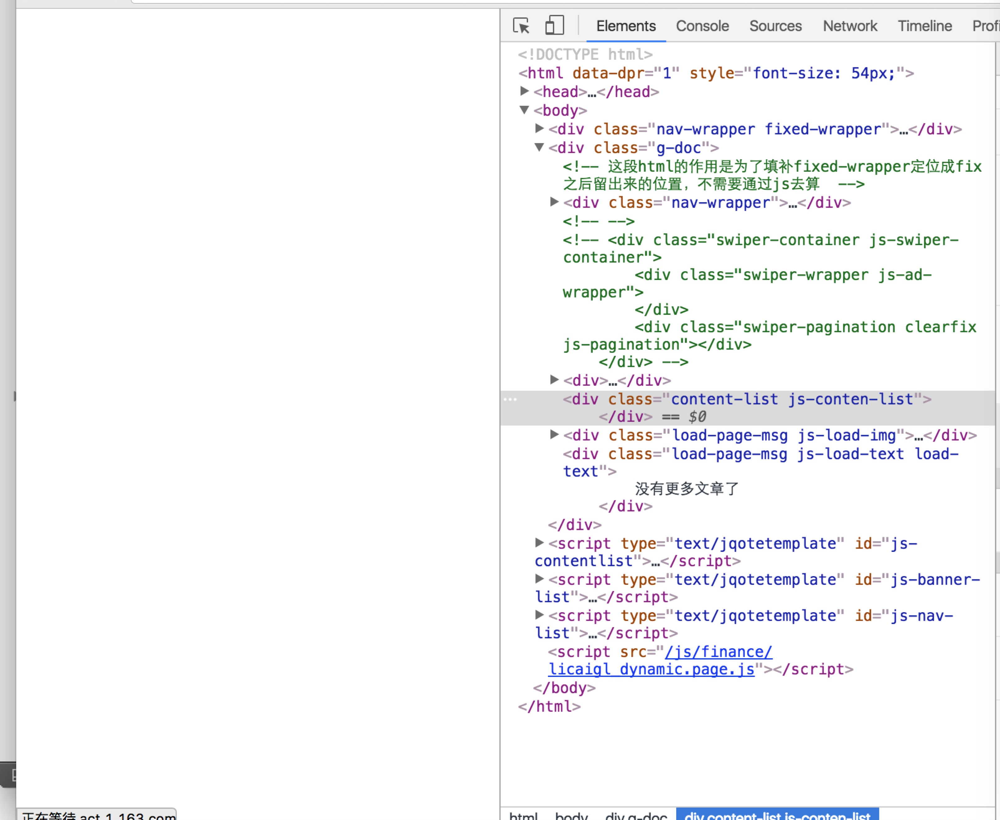

#html 页面下载与渲染中的一些过程

1.首先会下载html文档，下载完成之后再分析dom

2.会分析其中的一些资源请求的标签，如script，link，img等，并发出资源请求，并行下载。较老版本的浏览器，据说并没有并行下载的功能。

3.当下载js时，在等待请求的过程中，会阻止dom挂载到dom树上（这个描述估计不正确，以下出现类似的描述也是如此，具体表现可以看例图），只有在js之前出现的标签才会挂载到dom树中。如下图所示：
 script标签在head头部，当请求阻塞，只有其之前的dom会挂载到dom树上。(当script是defer脚本时，不会阻止dom挂载和渲染，拥有将script放在body底部的好处)

做一个对比：
如果把script请求放在页面底部，即时该js的请求被阻塞，由于他之前的dom和css已经加载完成，浏览器会把之前的dom渲染到页面中，避免出现白屏：如图所示：
 

4.当css请求被阻塞时，所有dom会挂载到dom树上，但是页面不会进行渲染，一片空白，而且在该css请求之后的js请求，下载完成之后不会进行执行：如下图所示：
 

这是在chrome51下的测试结果，也可能测试方式不正确导致测试结果错误。